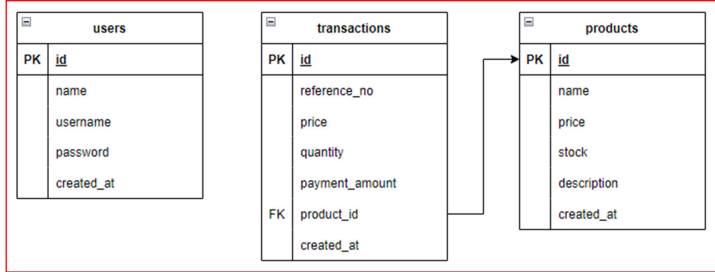

# Test Skill Fullstack - PT. Data Andalan Utama

## Deskripsi
Proyek test skill sebagai Full Stack Developer di PT. Data Andalan Utama. Proyek ini merupakan pembuatan sebuah web app yang terdiri dari backend menggunakan framework Laravel (versi terbaru), frontend menggunakan framework JavaScript (dengan preferensi Vue), dan database MySQL sebagai DBMS.


## Task

### Skema Database

<figure><figcaption></figcaption></figure>

* Users

```php
public function up(): void
    {
        Schema::create('users', function (Blueprint $table) {
            $table->id();
            $table->string('name');
            $table->string('username')->unique();
            $table->string('email')->unique();
            $table->timestamp('email_verified_at')->nullable();
            $table->string('password');
            $table->rememberToken();
            $table->timestamps();
            $table->softDeletes();
        });
    }
```

* Products

```php
 public function up(): void
    {
        Schema::create('products', function (Blueprint $table) {
            $table->id();
            $table->string('name');
            $table->decimal('price', 10, 2);
            $table->integer('stock');
            $table->text('description')->nullable();
            $table->timestamps();
            $table->softDeletes();
        });
    }
```

* Transactions

```php
public function up(): void
    {
        Schema::create('transactions', function (Blueprint $table) {
            $table->id();
            $table->string('reference_no');
            $table->decimal('price', 10, 2);
            $table->integer('quantity');
            $table->decimal('payment_amount', 10, 2);
            $table->unsignedBigInteger('product_id');
            $table->timestamps();
            $table->softDeletes();

            $table->foreign('product_id')->references('id')->on('products')->onDelete('cascade');
        });
    }
```


### Halaman Login

<figure><figcaption></figcaption></figure>


### Halaman Register

<figure><figcaption></figcaption></figure>

### Halaman Product

<figure><figcaption></figcaption></figure>

### Halaman Transaksi

<figure><figcaption></figcaption></figure>

## Installasi

1. Clone repository ini ke dalam direktori proyek Anda:

```
git clone https://github.com/danatriz/Test-Skill-Fullstack.git
```

2. Masuk ke direktori proyek:

```
cd fullstack
```

3. Install dependency PHP menggunakan Composer:

```
composer install
```

4. Install dependency frontend menggunakan Node.js:

```
npm install
```

5. Konfigurasi Database:
   * Buat database baru di MySQL sesuai dengan nama yang diinginkan.
   * Salin file `.env.example` menjadi `.env` dan sesuaikan konfigurasi database di dalamnya.
6. Jalankan migrasi dan seed untuk mengisi tabel dengan data awal:

```
php artisan migrate --seed
```

7. Generate Key

```
php artisan generate:key
```

7. Jalankan server lokal:

```
php artisan serve
```

8. Akses web app di browser Anda melalui URL berikut:

```
http://127.0.0.1:8000/
```
